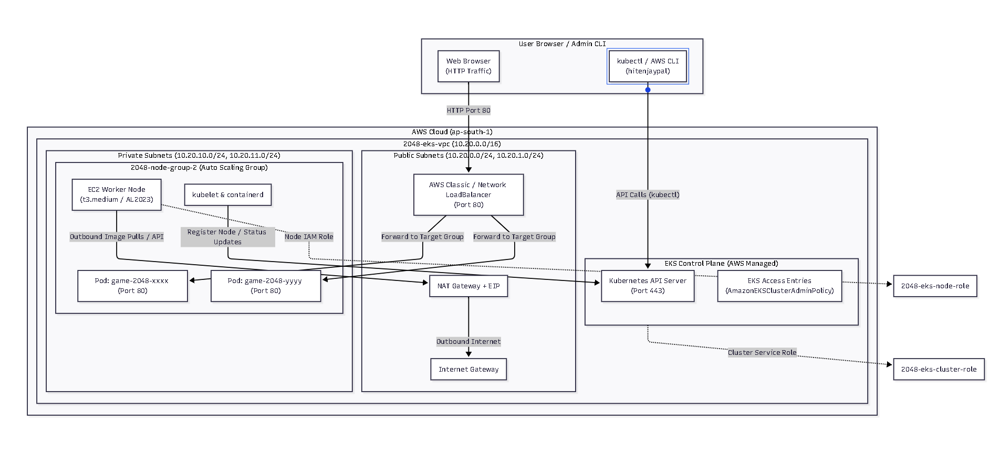

# Amazon EKS 2048 Game: Technical Architecture & Troubleshooting Report

---

## 1. System Architecture Overview




## 2. End-to-End Technical Request Flow

### A. Administration & Control Plane Access Flow
1. **CLI Authentication**: When you run `kubectl get nodes`, `kubectl` uses `aws-cli` to request a temporary bearer token from `sts:GetCallerIdentity` for user `hitenjaypal`.
2. **EKS Access Entry Verification**: The request reaches the EKS API Endpoint (`port 443`). EKS checks its **IAM Access Entries**. Since `arn:aws:iam::252556588942:user/hitenjaypal` has the `AmazonEKSClusterAdminPolicy` attached, authentication is granted.
3. **API Response**: The API server responds with cluster state data (e.g. node list).

### B. Worker Node Registration Flow
1. **EC2 Launch**: The Managed Node Group triggers an Auto Scaling Group to launch a `t3.medium` EC2 instance in a **Private Subnet**.
2. **Outbound Connectivity**: The worker node boots up and uses the **NAT Gateway** in the Public Subnet to make outbound internet connections (to pull container images and communicate with EKS control plane endpoints).
3. **Kubelet Bootstrap**: The `kubelet` process on the node uses `2048-eks-node-role` (`AmazonEKSWorkerNodePolicy`, `AmazonEKS_CNI_Policy`, `AmazonEC2ContainerRegistryPullOnly`) to authenticate via the EKS `EC2 Linux` Access Entry and register the node as `Ready`.

### C. Application Traffic Flow (User to 2048 Game)
1. **User Request**: User opens the LoadBalancer DNS URL in a web browser on port 80.
2. **Internet Gateway to ALB**: Traffic enters through the **Internet Gateway** and hits the **AWS Load Balancer** sitting in the **Public Subnets**.
3. **ALB to Pod Routing**: The LoadBalancer forwards incoming HTTP traffic directly across private subnets to the `game-2048` container Pods on port 80.

---

## 3. Deep-Dive: Issues Encountered & Root Cause Analysis

### 🐛 Issue 1: Node Group Stuck in `Creating` Status for 20+ Minutes
* **Root Cause 1 (IAM Policies Missing)**: During the initial creation of `2048-eks-node-role`, essential IAM managed policies (`AmazonEKSWorkerNodePolicy`, `AmazonEKS_CNI_Policy`, `AmazonEC2ContainerRegistryPullOnly`) were not properly attached. As a result, the EC2 instance could not initialize network interfaces or communicate with EKS.
* **Root Cause 2 (Public Access Source Allowlist Blocking NAT Gateway)**: The cluster endpoint access allowlist was locked down strictly to `106.205.212.246/32` (Home IP). When the private EC2 worker nodes tried to reach the EKS control plane via the NAT Gateway, the request originated from the **NAT Gateway's Public EIP**, which was blocked by the allowlist.
* **Solution**:
  1. Attached `AmazonEKSWorkerNodePolicy`, `AmazonEKS_CNI_Policy`, and `AmazonEC2ContainerRegistryPullOnly` to `2048-eks-node-role`.
  2. Updated EKS Public Access CIDR allowlist to `0.0.0.0/0` (or added NAT Gateway EIP).
  3. Added Security Group rule to `sg-00762a36aa8871c5b` allowing `10.20.0.0/16` on Port 443.
  4. Deleted stuck node group and created `2048-node-group-2`, which became **`Ready`** in 2 minutes.

---

### 🐛 Issue 2: `kubectl` Authentication Failure (`You must be logged in to the server`)
* **Root Cause**: The EKS cluster was initially created in the AWS Management Console while logged in under the **`root`** account. By default, EKS grants cluster admin rights exclusively to the identity that created the cluster. When running `kubectl` from CLI as IAM User `hitenjaypal`, access was denied because `hitenjaypal` was not listed in EKS Access Entries.
* **Solution**:
  1. Navigated to **EKS Console → 2048-eks-cluster → Access Tab → IAM Access Entries**.
  2. Created an Access Entry for `arn:aws:iam::252556588942:user/hitenjaypal`.
  3. Attached the **`AmazonEKSClusterAdminPolicy`** (Cluster scope).

---

### 🐛 Issue 3: Pods Stuck in `ErrImagePull` / `ImagePullBackOff`
* **Root Cause**: The legacy deployment YAML referenced `alexwhen/docker-2048:latest` and `blackicebird/2048:latest`, which were packaged using **Docker Manifest Schema v1**. Modern Kubernetes 1.36 and `containerd v2.1+` explicitly dropped support for Schema v1 (`application/vnd.docker.distribution.manifest.v1+prettyjws`).
* **Error Traceback**:
  ```text
  rpc error: code = Unimplemented desc = failed to pull and unpack image:
  media type "application/vnd.docker.distribution.manifest.v1+prettyjws" is no longer supported since containerd v2.1
  ```
* **Solution**:
  Updated `2048-deployment.yaml` to use **`public.ecr.aws/l6e2u8a3/2048:latest`** (the official AWS EKS workshop 2048 image built with modern OCI Schema v2 manifests).

---

### 🐛 Issue 4: `kubectl get pods,service --watch` Command Error
* **Root Cause**: In `kubectl`, the `--watch` flag only supports querying a single resource type at a time. Passing comma-separated resource types (`pods,service`) caused `kubectl` to throw `error: you may only specify a single resource type`.
* **Solution**: Separated the commands:
  ```bash
  kubectl get pods -n game-2048 --watch
  kubectl get svc -n game-2048
  ```
