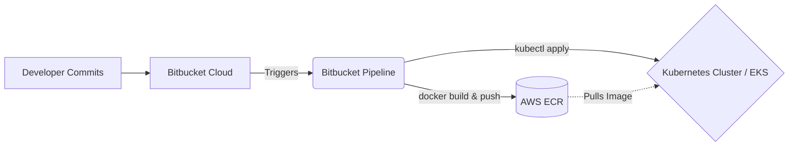
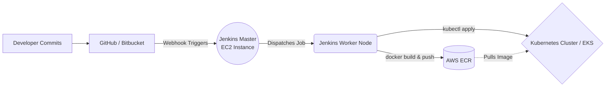

# CI/CD Pipeline Architecture & Deep Dive

This document explains the "why" and "how" of the Jenkins/Docker CI/CD pipeline implemented in this project. It dives into the problems it solves, how it provides value to an organization, and how to scale this architecture for large, enterprise-level projects.

## Architecture Overview
In this project, the architecture consists of:
1. **Source Code Management (GitHub):** The central repository for the Node.js source code.
2. **Continuous Integration Server (Jenkins on AWS EC2):** Automatically triggers on code commits. It pulls the latest code from GitHub.
3. **Deployment Target (Docker-Host on AWS EC2):** Jenkins uses SSH to push the code downstream to the target host.
4. **Container Runtime (Docker):** The Docker Host builds a Docker Image out of the Node.js application and spins it up as an isolated Container.

## What Problem Does this Solve?
Before automated CI/CD pipelines, deploying software was a heavily manual process.
* **Manual Errors:** Developers had to manually SSH into servers, pull code, stop the application, install dependencies, and restart it. This leads to human error.
* **Inconsistency:** An app might work on a developer's laptop but fail on the production server due to mismatched package versions or OS differences.
* **Slow Time-to-Market:** The process was tedious and typically relegated to release windows (e.g., late Friday nights), delaying feature delivery to customers.

**The Solution:** 
This pipeline automates the entire deployment safely. By combining **Jenkins (Automation)** and **Docker (Consistency)**, we eliminate human error during deployment and ensure the application runs consistently anywhere.

## Is it Time-Saving?
**Absolutely.** What used to take a DevOps engineer 30-60 minutes per manual deployment now takes 1-2 minutes and requires **zero human intervention**. This translates to hundreds of engineering hours saved per year. Furthermore, developers get immediate feedback if their code breaks the build, heavily reducing troubleshooting time.

## How It Works in a Real Organization
In an organizational setting, the workflow looks like this:
1. **Development:** A developer commits a feature to a specific branch (e.g., `feature/login`).
2. **Pull Request:** A peer reviews the code and approves it.
3. **Merge:** The code is merged into the `main` branch.
4. **Jenkins Trigger:** A GitHub Webhook instantly alerts Jenkins of the new code.
5. **Processing & Testing:** Jenkins pulls the code and runs automated unit and integration tests. (If tests fail, it halts and alerts the team on Slack).
6. **Building:** If tests pass, Jenkins instructs the Docker Host to build the new runtime image.
7. **Execution & Delivery:** The new container is deployed, instantly rolling out the new feature to the users without the operations team having to touch a server.

## Scaling to Big Projects (Enterprise Implementation)
While this project focuses on a simple Node.js app to teach the fundamentals, scaling it for a large corporate project involves the following enhancements:

- **Jenkinsfiles (Pipeline as Code):** Instead of using manual UI clicks in Jenkins to create jobs (Freestyle), large projects use a `Jenkinsfile` written in Groovy. This allows the pipeline logic to be version-controlled alongside the code itself.
- **Security Integration (DevSecOps):** Adding automated security scanning tools (like SonarQube for code quality and Trivy for container vulnerability scanning) before building the Docker image.
- **Image Registries (Docker Hub / AWS ECR):** Instead of Jenkins building the image locally on the deployment host, Jenkins builds the image centrally, pushes it to an artifact registry like AWS ECR, and then tells the remote server to merely pull (download) the finished image.
- **Orchestration (Amazon EKS / ECS):** A single Docker Host instance isn't highly available. Large projects deploy to AWS ECS or a Kubernetes cluster (EKS) spanning multiple Availability Zones to ensure zero-downtime rolling updates and auto-scaling to handle high traffic.
- **Multiple Environments:** The pipeline is duplicated for `Dev`, `QA`, `Staging`, and `Prod` with manual approval gates required before progressing to the live Production environment.

---

## Jenkins vs. Cloud-Native CI/CD (Bitbucket Pipelines, GitHub Actions)

In many modern organizations, you might see workflows that use **Bitbucket Pipelines** or **GitHub Actions** rather than Jenkins. For example: a Bitbucket Pipeline automatically builds an image, pushes it to AWS ECR with a commit tag, and then deploys that tag directly to a Kubernetes cluster (much like the flow described above). 

If Bitbucket Pipelines can do this smoothly, **why use Jenkins?** What problem does Jenkins solve that Bitbucket Pipelines cannot?

### 1. Advanced Customization and Extreme Flexibility
Bitbucket Pipelines and GitHub Actions are highly constrained cloud environments (SaaS). If you simply need a standard Docker container built and deployed to Kubernetes, they are fantastic and arguably better because they require zero server management. 

However, **Jenkins is a blank canvas.** If an organization has legacy custom scripts, requires complex hardware test nodes (e.g., executing tests on legacy Windows machines or physical mobile device racks), or needs to integrate with obscure internal enterprise tools, Jenkins has a plugin or the extreme flexibility to handle it. 

### 2. No Vendor Lock-In 
Bitbucket Pipelines lock you into Atlassian Bitbucket. GitHub Actions lock you into Microsoft GitHub. **Jenkins is completely vendor-agnostic.** You can migrate your source code from Bitbucket to GitLab to AWS CodeCommit, and your Jenkins EC2 server will still orchestrate your pipeline the exact same way with just a hook update.

### 3. Dedicated Infrastructure Control
With managed CI/CD (like Bitbucket Pipelines), you share compute resources with the cloud provider, and there are limits on build times, RAM, and storage limits per month. 
With Jenkins, **you own the EC2 instance (Master & Worker Nodes)**. If you need 128GB of RAM to compile a massive machine learning model or a huge monolithic application safely behind your private VPC firewall, you just upgrade the Jenkins EC2 instance. You have total control over the server environment, network restrictions, and IP whitelisting.

### Architecture Comparison

#### Managed Cloud CI/CD (e.g., Bitbucket Pipeline)
This is typically fully managed SaaS. No master server to maintain. Highly preferred for greenfield modern cloud-native applications.

#### Jenkins CI/CD (Self-Managed Enterprise Workflow)
Self-managed. You control the master, the agents, the network, and the security policies entirely in your private AWS VPC.

